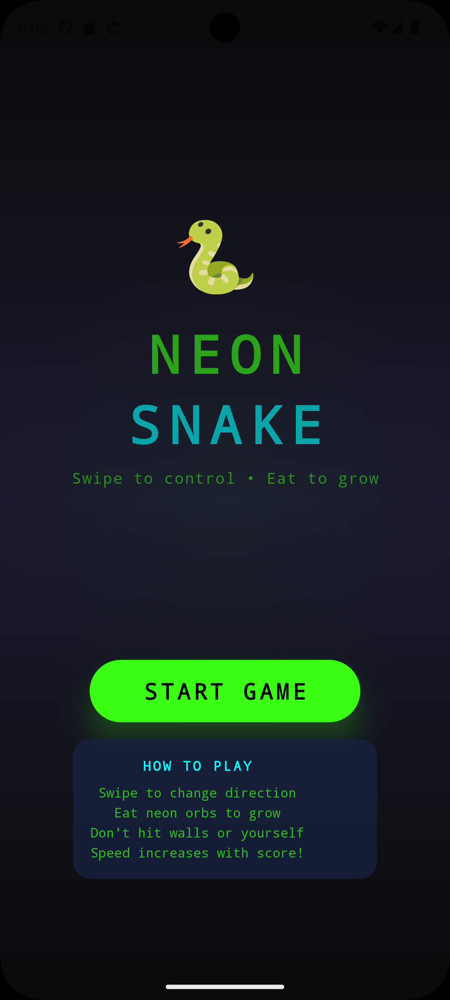
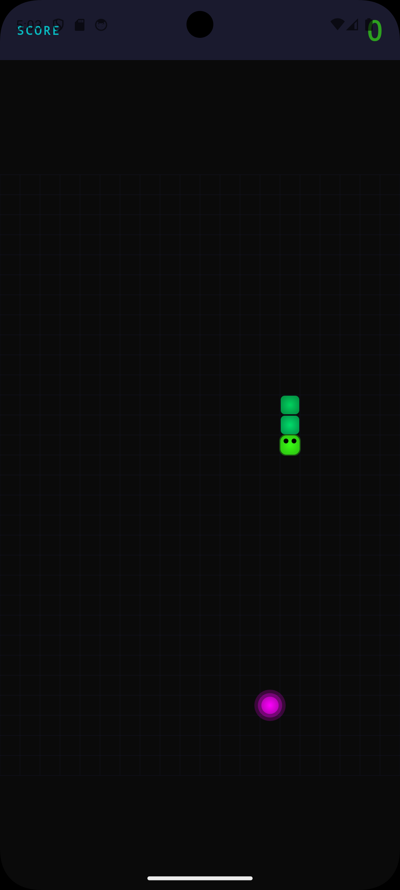
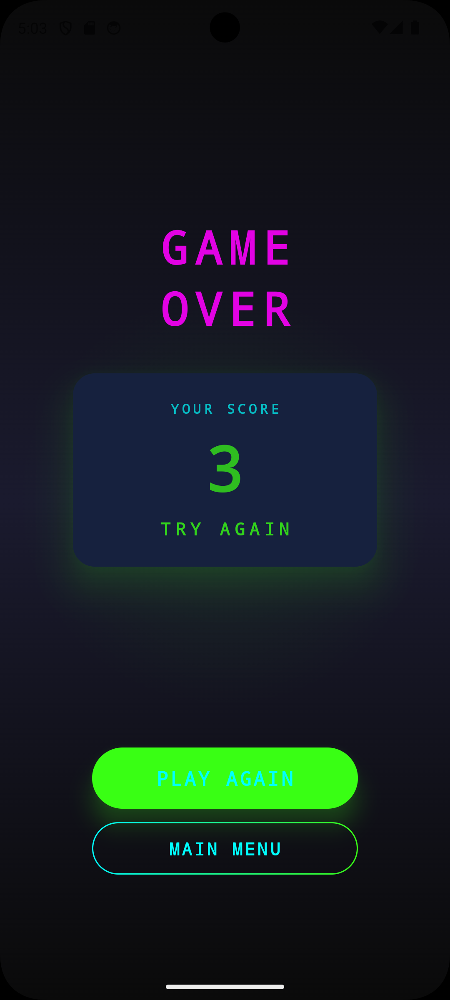

# Neon Snake

A modern Android snake game with a dark neon style, built with Kotlin and Jetpack Compose.

## Screenshots

<p align="center">
  
  
  
</p>

## Features
- Classic snake gameplay
- Swipe controls
- Neon visual theme
- Menu, game, and game-over screens
- Score-based speed increase

## Build
```bash
./gradlew assembleDebug
```

The debug APK will be created at:
`app/build/outputs/apk/debug/app-debug.apk`

## Download
Official release:
- [v1.0](https://github.com/seb-labs/NeonSnake/releases/tag/v1.0)

## Install
- Download the APK from the GitHub Release and install it manually.
- Or use `adb install -r app/build/outputs/apk/debug/app-debug.apk`.

## Technical details
- Language: Kotlin
- UI: Jetpack Compose
- Min SDK: 24
- Target SDK: 34

## Contact
`NeonSnake@seblabs.unbox.at`
